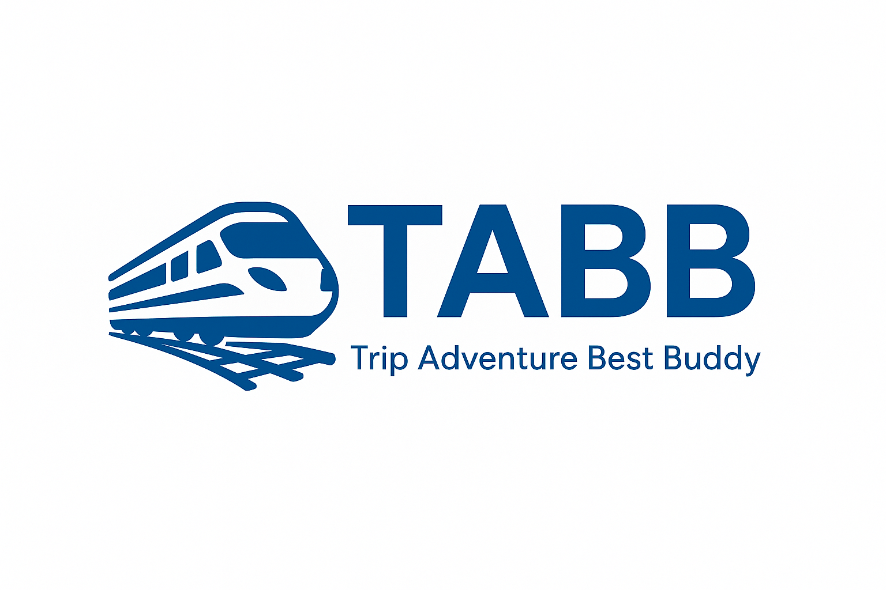

<a id="readme-top"></a>


<!-- PROJECT SHIELDS -->
<!--
*** I'm using markdown "reference style" links for readability.
*** Reference links are enclosed in brackets [ ] instead of parentheses ( ).
*** See the bottom of this document for the declaration of the reference variables
*** for contributors-url, forks-url, etc. This is an optional, concise syntax you may use.
*** https://www.markdownguide.org/basic-syntax/#reference-style-links
-->
[![Contributors][contributors-shield]][contributors-url]
[![Forks][forks-shield]][forks-url]
[![Stargazers][stars-shield]][stars-url]
[![Issues][issues-shield]][issues-url]
[![Unlicense License][license-shield]][license-url]
<!-- [![LinkedIn][linkedin-shield]][linkedin-url] -->


<!-- PROJECT LOGO -->
<br />
<div align="center">
  <a href="https://github.com/binhbb2204/railway-app-web">
    
  </a>

  <h3 align="center">Trip Adventure Booking Buddy</h3>

  <p align="center">
    A Web Application Development project about the Railway Management System
    <br />
    <a href="https://mphcmiuedu-my.sharepoint.com/:w:/g/personal/itcsiu22269_student_hcmiu_edu_vn/ESD91aukkTFNkMJzY4Cho7oBZCaJKTV6lwXJEZphetW0GQ?e=LjgS0b"><strong>Explore the docs »</strong></a>
    <br />
    <br />
    <a href="https://railway-tabb.onrender.com/">View Demo</a>
    &middot;
    <a href="https://github.com/binhbb2204/railway-app-web/issues/new?labels=bug&template=bug-report---.md">Report Bug</a>
    &middot;
    <a href="https://github.com/binhbb2204/railway-app-web/issues/new?labels=enhancement&template=feature-request---.md">Request Feature</a>
  </p>
</div>


<!-- TABLE OF CONTENTS -->
<details>
  <summary>Table of Contents</summary>
  <ol>
    <li>
      <a href="#about-the-project">About The Project</a>
      <ul>
        <li><a href="#built-with">Built With</a></li>
      </ul>
    </li>
    <li>
      <a href="#getting-started">Getting Started</a>
      <ul>
        <li><a href="#prerequisites">Prerequisites</a></li>
        <li><a href="#installation">Installation</a></li>
      </ul>
    </li>
    <li><a href="#usage">Usage</a></li>
    <li><a href="#roadmap">Roadmap</a></li>
    <li><a href="#contributing">Contributing</a></li>
    <li><a href="#license">License</a></li>
    <li><a href="#contact">Contact</a></li>
    <li><a href="#acknowledgments">Acknowledgments</a></li>
  </ol>
</details>


<!-- ABOUT THE PROJECT -->
## About The Project

[![Product Name Screen Shot][product-screenshot]]()

In the present day, railway transportation is still an indisputable mean of transport for millions of people, but many train systems use a tradition-based, outdated or a fragmented solution to manage ticket booking, schedule and customer communication. This typically leads to inefficiencies, overbooking, long waiting times, difficulty in obtaining real-time information, and a suboptimal travel experience for the passengers.

Here's why we built this system:
* Railway personnel need efficient tools to manage bookings, track transactions and update schedules in real time
* Passengers deserve an integrated system for easy search, booking, payment, and review features
* Manual processing exposes operators to potential errors, security risks, and scaling challenges
* Modern railway services require automation to increase efficiency and customer satisfaction

Without an integrated, automated system, coordinating among users and administrators becomes cumbersome, slow, and unsatisfactory. Our Railway Management System addresses these challenges by providing a simple web interface for customers and comprehensive administration tools for managers.


<p align="right">(<a href="#readme-top">back to top</a>)</p>


### Built With

* [![React][React.js]][React-url]
* [![Node.js][Node.js]][Node-url]
* [![Express.js][Express.js]][Express-url]
* [![Tailwind CSS][TailwindCSS]][Tailwind-url]
* [![MySQL][MySQL]][MySQL-url]
* [![Bootstrap][Bootstrap.com]][Bootstrap-url]
* [![Framer Motion][FramerMotion]][Framer-url]

<p align="right">(<a href="#readme-top">back to top</a>)</p>


<!-- GETTING STARTED -->
## Getting Started

To get a local copy up and running, follow these simple steps.

### Prerequisites

Make sure you have the following installed on your system:

* **Node.js** (version 14 or higher)
    ```sh
    # Check your Node.js version
    node --version
    ```

* **npm** (comes with Node.js)
    ```sh
    npm install npm@latest -g
    ```

* **MySQL** (version 8.0 or higher)
    - Download and install from [MySQL Official Website](https://dev.mysql.com/downloads/)
    - Make sure MySQL server is running

### Installation

1. **Clone the repository**
    ```sh
    git clone https://github.com/binhbb2204/railway-app-web.git
    cd railway-app-web
    ```

2. **Install root dependencies**
    ```sh
    npm install
    ```

3. **Set up the Backend**
    ```sh
    cd backend
    npm install
    ```

4. **Set up MySQL Database**
    
    **Option 1: Import existing schema (Recommended)**
    ```sh
    # Create the database
    mysql -u root -p -e "CREATE DATABASE railway_web;"
    
    # Import the database schema from mysql_files
    mysql -u root -p railway_web < mysql_files/railway_web.sql
    ```
    
    **Option 2: Let the application create tables automatically**
    - Create a new database named `railway_web`
    - The application will create tables when first run

5. **Configure Gmail App Password**
    
    For email verification and OTP functionality:
    
    a. **Enable 2-Factor Authentication** on your Gmail account:
       - Go to [Google Account Security](https://myaccount.google.com/security)
       - Enable 2-Step Verification
    
    b. **Generate App Password**:
       - Go to [App Passwords](https://myaccount.google.com/apppasswords)
       - Select "Mail" and your device
       - Copy the 16-character password (remove spaces)

6. **Generate JWT Secret**
    
    Create a secure JWT secret key:
    ```sh
    # Option 1: Use Node.js crypto (Recommended)
    node -e "console.log(require('crypto').randomBytes(64).toString('hex'))"
    
    # Option 2: Use online generator
    # Visit: https://jwt.io/ and generate a secure secret
    ```

7. **Create environment variables**
   
    Create a `.env` file in the `backend` folder with the following content:
    ```env
    # Database Configuration
    DB_HOST=localhost
    DB_USER=root
    DB_PASSWORD=your_mysql_password
    DB_NAME=railway_web
    
    # Server Configuration
    PORT=5000
    
    # JWT Secret (use the generated secret from step 6)
    JWT_SECRET=your_generated_jwt_secret_key_here
    
    # Email Configuration (use credentials from step 5)
    EMAIL_USER=your_email@gmail.com
    EMAIL_PASS=your_16_character_app_password
    ```

8. **Set up the Frontend**
    ```sh
    cd ../frontend
    npm install
    ```

9. **Configure Frontend Environment (Optional)**
    
    Create a `.env` file in the `frontend` folder:
    ```env
    REACT_APP_BACKEND_URL=https://your-backend-url.com
    ```
    
    For local development, you can skip this step as it defaults to `localhost:5000`

10. **Start the Application**
   
    **Option 1: Run both frontend and backend simultaneously (Recommended)**
    ```sh
    # From the root directory
    npm run dev
    # This will start both backend (localhost:5000) and frontend (localhost:3000)
    ```
    
    **Option 2: Run separately**
    
    Backend (Terminal 1):
    ```sh
    cd backend
    npm start
    # Server will run on http://localhost:5000
    ```
    
    Frontend (Terminal 2):
    ```sh
    cd frontend
    npm start
    # Application will open on http://localhost:3000
    ```

### Quick Start for Development

The easiest way to get started is using the `npm run dev` command from the root directory, which will:

1. Start the backend server on `http://localhost:5000`
2. Start the frontend development server on `http://localhost:3000`  
3. Automatically handle API requests between frontend and backend

### Troubleshooting

**Database Connection Issues:**
- Ensure MySQL server is running
- Verify database credentials in `.env` file
- Check if the `railway_web` database exists

**Email/OTP Issues:**
- Verify Gmail app password is correct (16 characters, no spaces)
- Ensure 2-Factor Authentication is enabled on Gmail
- Check EMAIL_USER and EMAIL_PASS in `.env` file

**JWT Authentication Issues:**
- Ensure JWT_SECRET is properly set in `.env` file
- Use a sufficiently long and random secret key

### Live Demo

You can also view the live application at: [https://railway-tabb.onrender.com/](https://railway-tabb.onrender.com/)

<p align="right">(<a href="#readme-top">back to top</a>)</p>


<!-- USAGE EXAMPLES -->
## Usage

Our Railway Management System provides a comprehensive platform for both passengers and administrators. Below are the key features and how to use them:

### For Passengers

**Home Page**
This is the main home page of the application. This page will capture some background information about the team.

![Home Page Screenshot][home-screenshot]

**About Page**
This page provides a closer look at what we do, our objectives, as well as the members of the project.

![About Page Screenshot][about-screenshot]

**Timetable**
This page includes the train route information.

![Timetable Screenshot][timetable-screenshot]

**Buy Ticket**
In this page, users can book their tickets by choosing their preferred options.

![Buy Ticket Screenshot][buy-ticket-screenshot]

**Check Ticket**
In this page, users can check for their booked tickets.

![Check Ticket Screenshot][check-ticket-screenshot]

**User Menu**
This is an extra drop-down menu for the users. In this menu, they can change settings and view their processed bookings.

![User Menu Screenshot][user-menu-screenshot]

**Settings Page**
This is the Settings page of the user. It displays personal information of their account, as well as some options to modify their credentials and view the bookings.

![Settings Page Screenshot][settings-screenshot]

![My Booking Page Screenshot][mybooking-screenshot]

### For Administrators

**Admin Dashboard**
This is the main dashboard of the Admin Panel – where administrators will manage the system. In this page, general information are shown, including:
- **System Alerts** - Important notices about train delays, cancellations, and maintenance work
- **Train Status** - Charts showing how many trains are running on time, delayed, or cancelled
- **Station Traffic** - Information about which stations are busiest
- **Maintenance Schedule** - List of upcoming repair work

![Admin Dashboard Screenshot][admin-dashboard-screenshot]

_For more examples, please refer to the [Documentation](https://mphcmiuedu-my.sharepoint.com/:w:/g/personal/itcsiu22269_student_hcmiu_edu_vn/ESD91aukkTFNkMJzY4Cho7oBZCaJKTV6lwXJEZphetW0GQ?e=LjgS0b)_

<p align="right">(<a href="#readme-top">back to top</a>)</p>


<!-- ROADMAP -->
## Roadmap

### Planning & Preparation
☑️ Project Kick-off and team formation  
☑️ Gather tools, materials and requirements  
☑️ Define system scope  
☑️ Select technology stack and set up development environment  

### Conceptual Design
☑️ UI/UX wireframing and component design  
☑️ API endpoints and service layer planning  
☑️ Authentication and authorization strategy  

### Implementation
☑️ Frontend core components and navigation  
☑️ User authentication/registration system  
☑️ Station and train management functionality  
☑️ Schedule and journey implementation  
☑️ Ticket booking and payment system  
☑️ Admin panel dashboard implementation  
☑️ Database models implementation (MySQL schemas)  
☑️ Backend API core structure and controllers  

### Testing & Debugging
☑️ Backend API unit and integration testing  
☑️ Frontend component and UI testing  
☑️ End-to-end system testing and bug fixing  

### Completion & Presentation
⏳ Documentation, finalization and final presentation

See the [open issues](https://github.com/binhbb2204/railway-app-web/issues) for a full list of proposed features (and known issues).

<p align="right">(<a href="#readme-top">back to top</a>)</p>


<!-- CONTRIBUTING -->
## Contributing

Contributions are what make the open source community such an amazing place to learn, inspire, and create. Any contributions you make are **greatly appreciated**.

If you have a suggestion that would make this better, please fork the repo and create a pull request. You can also simply open an issue with the tag "enhancement".
Don't forget to give the project a star! Thanks again!

1. Fork the Project
2. Create your Feature Branch (`git checkout -b feature/AmazingFeature`)
3. Commit your Changes (`git commit -m 'Add some AmazingFeature'`)
4. Push to the Branch (`git push origin feature/AmazingFeature`)
5. Open a Pull Request

### Top contributors:

<a href="https://github.com/binhbb2204/railway-app-web/graphs/contributors">
  
</a>

<p align="right">(<a href="#readme-top">back to top</a>)</p>


<!-- LICENSE -->
## License

Distributed under the MIT License. See `LICENSE` for more information.

<p align="right">(<a href="#readme-top">back to top</a>)</p>


<!-- CONTACT -->
## Contact

| Name              | Student ID  | Email                            |
|-------------------|-------------|----------------------------------|
| Trần Thanh Bình   | ITCSIU22255 | ITCSIU22255@student.hcmiu.edu.vn |
| Hoàng Thiên Ân    | ITCSIU22248 | ITCSIU22248@student.hcmiu.edu.vn |
| Nguyễn Minh Thuận | ITCSIU22269 | ITCSIU22269@student.hcmiu.edu.vn |
| Phạm Vũ Hoàng Bảo | ITCSIU22250 | ITCSIU22250@student.hcmiu.edu.vn |

Project Link: [Trip & Adventure Booking Buddy](https://github.com/binhbb2204/railway-app-web)

<p align="right">(<a href="#readme-top">back to top</a>)</p>


<!-- ACKNOWLEDGMENTS -->
## Acknowledgments

Reference

* [DSV Group. (n.d.). DSVN: Vietnam railway online ticketing platform.](https://dsvn.vn/#/)
* [Postman. (n.d.). Postman: API platform for building and using APIs](https://www.postman.com/)
* [Online Database Hosting Service - aiven.io](https://aiven.io/)
* [Website Deployment Service - Render](https://render.com/)

<p align="right">(<a href="#readme-top">back to top</a>)</p>


<!-- MARKDOWN LINKS & IMAGES -->
<!-- https://www.markdownguide.org/basic-syntax/#reference-style-links -->
[contributors-shield]: https://img.shields.io/github/contributors/binhbb2204/railway-app-web.svg?style=for-the-badge
[contributors-url]: https://github.com/binhbb2204/railway-app-web/graphs/contributors
[forks-shield]: https://img.shields.io/github/forks/binhbb2204/railway-app-web.svg?style=for-the-badge
[forks-url]: https://github.com/binhbb2204/railway-app-web/network/members
[stars-shield]: https://img.shields.io/github/stars/binhbb2204/railway-app-web.svg?style=for-the-badge
[stars-url]: https://github.com/binhbb2204/railway-app-web/stargazers
[issues-shield]: https://img.shields.io/github/issues/binhbb2204/railway-app-web.svg?style=for-the-badge
[issues-url]: https://github.com/binhbb2204/railway-app-web/issues
[license-shield]: https://img.shields.io/github/license/binhbb2204/railway-app-web.svg?style=for-the-badge
[license-url]: https://github.com/binhbb2204/railway-app-web/blob/master/LICENSE.txt
[linkedin-shield]: https://img.shields.io/badge/-LinkedIn-black.svg?style=for-the-badge&logo=linkedin&colorB=555
[linkedin-url]: https://linkedin.com/in/othneildrew
[product-screenshot]: images/screenshot.png
[React.js]: https://img.shields.io/badge/React-20232A?style=for-the-badge&logo=react&logoColor=61DAFB
[React-url]: https://reactjs.org/
[Bootstrap.com]: https://img.shields.io/badge/Bootstrap-563D7C?style=for-the-badge&logo=bootstrap&logoColor=white
[Bootstrap-url]: https://getbootstrap.com
[Node.js]: https://img.shields.io/badge/Node.js-43853D?style=for-the-badge&logo=node.js&logoColor=white
[Node-url]: https://nodejs.org/
[Express.js]: https://img.shields.io/badge/Express.js-404D59?style=for-the-badge&logo=express&logoColor=white
[Express-url]: https://expressjs.com/
[TailwindCSS]: https://img.shields.io/badge/Tailwind_CSS-38B2AC?style=for-the-badge&logo=tailwind-css&logoColor=white
[Tailwind-url]: https://tailwindcss.com/
[MySQL]: https://img.shields.io/badge/MySQL-00000F?style=for-the-badge&logo=mysql&logoColor=white
[MySQL-url]: https://www.mysql.com/
[Bootstrap.com]: https://img.shields.io/badge/Bootstrap-563D7C?style=for-the-badge&logo=bootstrap&logoColor=white
[Bootstrap-url]: https://getbootstrap.com
[FramerMotion]: https://img.shields.io/badge/Framer_Motion-black?style=for-the-badge&logo=framer&logoColor=blue
[Framer-url]: https://www.framer.com/motion/

[home-screenshot]: images/home-page.png
[about-screenshot]: images/about-page.png
[timetable-screenshot]: images/timetable-page.png
[buy-ticket-screenshot]: images/buy-ticket-page.png
[check-ticket-screenshot]: images/check-ticket-page.png
[user-menu-screenshot]: images/user-menu.png
[settings-screenshot]: images/settings-page.png
[mybooking-screenshot]: images/mybooking-page.png
[admin-dashboard-screenshot]: images/admin-dashboard.png